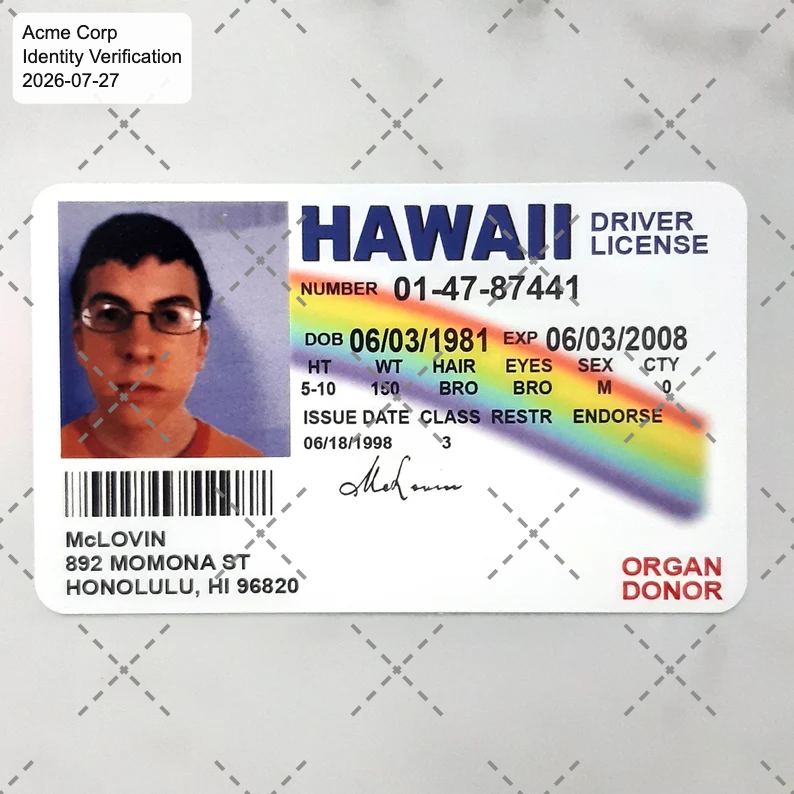

# tracemark

A single-page browser tool that stamps a document image (e.g. a scanned passport
or ID) with a tamper-evident watermark, so a copy can be shared with a specific
party for a specific purpose without being silently reused elsewhere.

It applies two things:

1. **A repeating diamond lattice** across the whole image — dashed 45°/135°
   diagonal lines with an X at every intersection. Because it covers the entire
   page, it can't be removed by cropping.
2. **A rounded info card** in the top-left corner showing who the copy was given
   to, why, and when.

It also embeds the same text as a PNG comment for forensic tracing (see
[Metadata](#metadata)).

## Privacy

Everything runs **entirely in your browser**. The image is read, watermarked,
and downloaded on your own device — it is **never uploaded**, and there is no
server, storage, or backend involved.

## Use it

### Online

Just open **https://andreaaguiar.github.io/tracemark/**, choose an image, fill in
the fields, and click **Download**.

### Locally

`index.html` is completely self-contained (no dependencies, no build step), so you can open
it directly in a browser, or serve the folder:

```sh
python3 -m http.server   # then visit http://localhost:8000
```

### Fields

| Field        | Notes                                                        |
|--------------|--------------------------------------------------------------|
| Document     | The image to watermark (never leaves your device).           |
| Company      | Who the copy is provided to — shown on the card and traced.  |
| Purpose      | Why the copy is being shared.                                |
| Date         | Shown on the card; defaults to today.                        |
| Lattice color| Any color; defaults to gray (`#808080`).                     |
| Opacity      | Lattice visibility; defaults to `0.80`.                      |

The download is named `<input>-watermarked.png`.

## Example output

Running [`id.png`](id.png) through the tool (company "Acme Corp", purpose
"Identity Verification", gray lattice) produces:




## Design notes

### Lattice

- The pattern is built from one square **tile** repeated across the image. The
  tile size **scales with the image width** (`tile = imageWidth × 103/300`), so
  the diamonds keep the same proportions relative to the document on any size.
- The perpendicular distance between adjacent diagonal lines is `tile / √2`
  (≈ 24.3% of the image width).
- Each dash segment's exact endpoints are computed and drawn individually, so
  every X lands precisely centered in a gap. Each half-diagonal reads:
  `[X] gap dash gap dash gap dash — BIG gap — dash gap dash gap dash gap [X]`.
- The lattice is tiled onto the canvas and centered, so the grid is symmetric
  about the middle of the image.

### Info card

- Rounded white card (≈92% opaque) with three uniform, regular-weight,
  near-black lines: company, purpose, date.
- All sizes scale off the larger image dimension, so the card stays proportional
  on both portrait and landscape scans.

## Metadata

The output PNG carries the sentence
`Provided exclusively to <company> for <purpose> on <date>` as a UTF-8 `iTXt`
`comment` chunk, injected into the PNG bytes in the browser. This is a
**secondary, best-effort trace only** — PNG comments are trivially stripped by
re-saving, screenshotting, or most sharing platforms, so the visible lattice
remains the real deterrent. Read it back with any PNG metadata tool, e.g.:

```sh
magick identify -format '%[comment]\n' out.png   # ImageMagick
exiftool -Comment out.png                        # exiftool
```

## Notes & limitations

- The visible watermark is a deterrent against casual reuse, not a cryptographic
  guarantee. A determined editor can still remove it with effort.
- Output is always PNG (the tracing comment relies on the PNG comment chunk).
- Re-encoding through the canvas drops the source image's metadata (EXIF/GPS),
  so the original scan's camera and location data are not carried into the copy.
